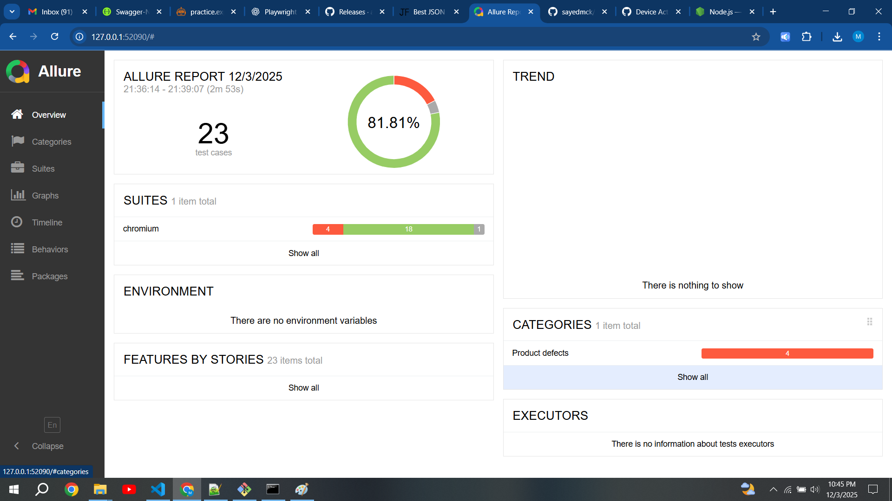
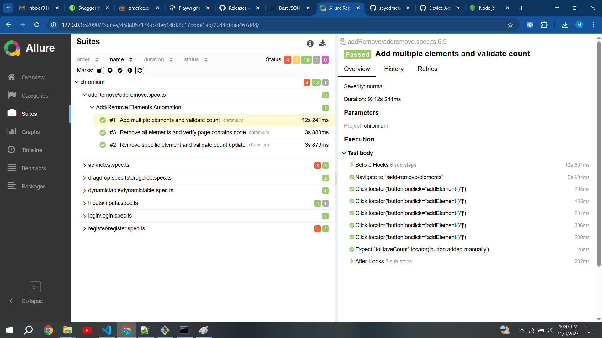
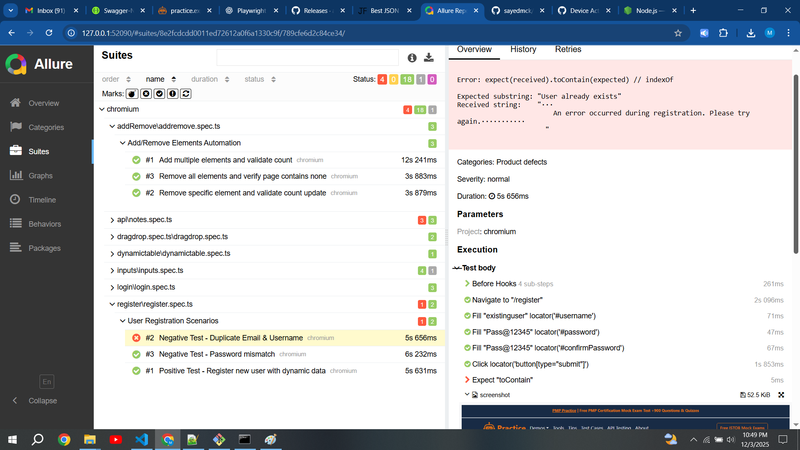

# Playwright Framework
This repository contains playwright framework for ui/api test autmation using TypeScript

## Usage

- Download and install in your system follow https://nodejs.org/en/download.
- Clone the repository and install dependencies using `npm install`.
- Run tests using `npm test`.
- View test reports in the `playwright-report` directory.
- html reports using `npm run report:html`
- allure reports using `npm run report:allure`

## Description
### `node_modules`

- Directory containing Node.js modules installed by npm.

### `playwright-report`

- Directory for storing Playwright test reports.

### `src`

- Source code directory containing project files.

#### `api`

- Directory for API-related scripts.

#### `config`

- Directory containing environment configuration files and authentication data.

#### `fixtures`

- Directory for test fixtures, such as reusable functions for login.

#### `logging`

- Directory for log files generated during test execution.

#### `pages`

- Page object files representing different pages of the application under test.

#### `testdata`

- Directory containing test data files in various formats, such as JSON and CSV.

#### `tests`

- Directory for test scripts written in TypeScript.

#### `utils`

- Directory for utility scripts used in testing, such as encryption and logging utilities.

### `test-results`

- Directory for storing test execution results, including screenshots, trace files, and videos.

## Notes
- I have tried to automated both UI and API using Playwright and TypeScript.
- Followed Page Object Model (POM) or equivalent modular design.
- Outline Framework structure put example or some reusable classes wherever need to showcase framework design.
- Test Data, fixtures, or external files for data-driven tests used for some assignment, other places did not use to save sometime.
- credentials are exposed in env file and code, that should ideally come from CI Credentials Manager or vault etc.
- Attached Allure report to show execution results. 
- CI part can be integrated using Jenkins/Azure either static agent or dynamic agent like docker
- Apologize for not ensuring clean Git history, was in hurry to wrap all things at once.

## Test Execution Results

## Part 1 Situational Questions
1. A critical test case involving third-party integration (e.g., payments) is failing due to API downtime. 
How do you design automation to handle this while ensuring reliability?
- Annswer: Use Mocking / Stubbing, mock payment API, Stub known responses (success, failure, edge cases).

2. Test data becomes stale (unique emails/usernames get used up). How do you design repeatable and independent test data management?
- Answer: Use Dynamic Test Data Generators with unique ids or random numbers, delete data created using tear down at the end,
so that when we run tests next, it should not create problems. Use APIs to create and delete in setup and tear down

3. Tests run fine locally but fail in Docker/CI due to selector issues. How do you debug and resolve environment-specific automation issues?
- Answer: Always create stable locator, avoid week locators, we can capture screenshot on failure, videos, that helps in debugging, 
check for any rendering issues or resolution. Run in CI with headed mode visusalize and fix.

4. Leadership wants ROI (Return on Investment). How do you demonstrate automation ROI effectively?
- Answer: Execution Time Saved-Manual execution hours vs automated execution minutes, Regression Cycle reduced and  
Bug leakage metrics and cost saving

5. Local tests pass but fail intermittently in CI. How do you isolate & fix flaky tests behavior to maintain trust in your automation suite??
- Answer: Mostly test fails intermittently due to timing issues- In that case use properly explicit waits, do not use static wait,
also can try retry mechanism, other cause could be due unstable locator- do not use locator based on DOM hierarchy, css stlye, absolute path etc, 
use stable locator base on role, text etc. If we fix these both areas can fix most of the flaky tests

6. You are given only 2 days to automate 15 new scenarios. How would you prioritize what to automate, and what trade-offs would you make?
- Answer: Automate High-Risk / High-Value Scenarios First

7. A teammate commits new test scripts with poor design (e.g., hard-coded waits, duplicated logic). 
How do you handle this situation while maintaining code quality and team morale?
- Answer: Perform constructive code review, ask him to change hard code waits with explicit waits, ask him to follow DRY principles
help him fixing these issues with peer programming and help/mentor on coding practices and setup static code analyzer IDE plugins like ESLint

8. Your automation suite suddenly takes 2+ hours in CI/CD, delaying releases. 
How do you diagnose performance bottlenecks, and what strategies would you use to optimize test execution?
- Answer: Analyze the test suite see where all the time is going, why it is taking more time, fix static waits if any.
try to replace set up and tear down with API calls if using UI for it, optimize waiting startegy like default waits
have minimal waits etc. This reduce time upto some extent, if the suite is running sequentially, then use parallel way 
which will reduce the time drastically.